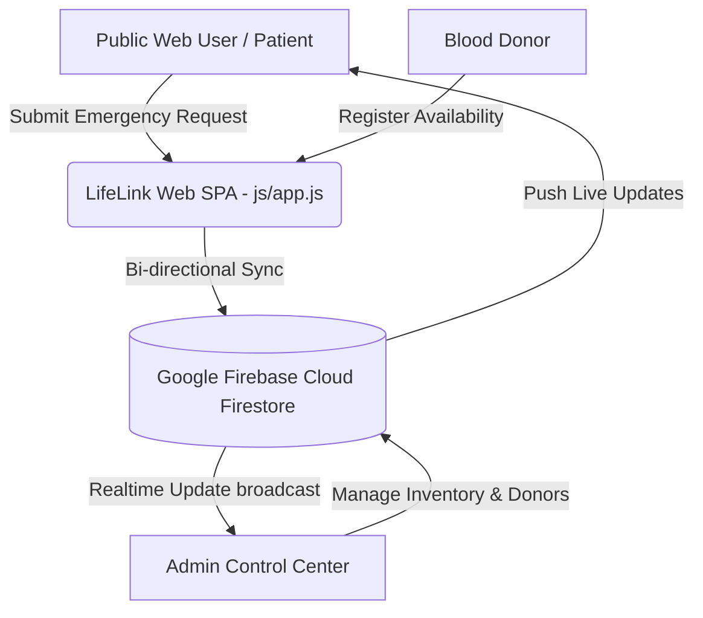

# 🩸 LifeLink – Smart Blood Donor & Emergency Network

<div align="center">


**An intelligent, real-time blood donation matching & emergency dispatch platform built to reduce critical blood shortage response times.**

[Live Web App](https://neuronova-phi.vercel.app/) · [Report Bug](https://github.com/sunandadutta730/NeuroNova/issues) · [Request Feature](https://github.com/sunandadutta730/NeuroNova/issues)

</div>

---

## 📌 Problem Statement

Every year, thousands of critical medical emergencies — especially involving rare blood types such as **AB-**, **B-**, and **O-** — suffer severe delays due to fragmented communication between patients, hospitals, blood banks, and willing donors. Standard manual phone call chains take hours, while patients need matches in **minutes, not units**.

---

## ✨ Solution & Key Features

**LifeLink** bridges this gap by unifying donors, hospitals, emergency dispatchers, and blood bank inventories onto **one real-time cloud network**.

### 🌟 Core Highlights:
* 🩸 **Smart Compatibility Engine**: Instant multi-directional blood group compatibility resolution (Universal Donors vs. Receivers).
* 🚨 **Urgent Emergency Dispatcher**: Real-time emergency request broadcasting with urgency tiers (`Normal`, `Urgent`, `Critical`) and distance calculations.
* 🛡️ **Discrete Admin Control Center**: A secure, role-restricted admin portal accessible via custom authentication gate for managing donor registries, emergency requests, stock inventories, and shortage alerts.
* ⚡ **Google Firebase Realtime Sync**: Instant bi-directional cloud synchronization across all open client screens using Cloud Firestore.
* 🎨 **Hackathon-Grade Visual Aesthetics**: Modern dark/light glassmorphic UI, custom vector SVG icon system, pulse beacon animations, ECG waveform tracer, and staggered scroll reveal effects.

---

## 🛠️ Technology Stack

| Layer | Technology Used | Badges |
| :--- | :--- | :--- |
| **Frontend Core** | HTML5 Semantic Architecture, Vanilla JavaScript (ES6+ Single Page Application) |   |
| **Styling & Motion** | Custom CSS3 Modular Design System, Flexbox/Grid, Keyframe Animations |  |
| **Iconography** | Dynamic Inline High-Detail Vector SVG Icons Engine |  |
| **Cloud Backend** | Google Firebase (App, Cloud Firestore DB, Realtime Auth API) |  |
| **Hosting & CI/CD** | GitHub Pages / Local HTTP Server |  |

---

## 🏗️ Architecture & Data Flow



---

## 📁 Clean & Scalable Directory Structure

```
LifeLink/
├── assets/                  # Static assets (images, icons, logos, fonts, animations, videos)
├── css/                     # Modular CSS (variables, components, forms, dashboard, responsive, style)
├── js/                      # Modular JS (app, firebase, auth, donor, receiver, hospital, admin, map, ui, utils, validation)
├── data/                    # Sample & mock data repositories (sample-data/donors.js)
├── docs/                    # API, Database, Structure & Deployment Documentation
├── config/                  # Configuration (constants.js, firebase-config.js)
├── index.html               # Main SPA HTML entry shell
├── README.md                # Project documentation & presentation guide
├── LICENSE                  # MIT Open Source License
├── .gitignore               # Excluded file list
├── .env.example             # Environment template
└── package.json             # NPM package manifest & scripts
```

Detailed architecture breakdown available in [docs/PROJECT_STRUCTURE.md](docs/PROJECT_STRUCTURE.md).

---

## 🔐 Demo Admin Access Credentials

For hackathon evaluators, judges, and testing:

* **Admin Portal Gate**: Click `🔐 Login` in Header ➔ Select `Administrator` role tab.
* **Passcode**: `admin123`
* **Admin Capabilities**: Mark donors available/unavailable in real time, delete records, update emergency request status (`Pending` ➔ `In Progress` ➔ `Resolved`), adjust blood bank stock units, and publish platform-wide shortage alerts.

---

## 🚀 Quick Start & Local Setup

### Prerequisites
* Any modern web browser (Google Chrome, Mozilla Firefox, Safari, Microsoft Edge).
* Local HTTP server (Python, VSCode Live Server, or Node http-server).

### Step 1: Clone Repository
```bash
git clone https://github.com/sunandadutta730/LifeLink.git
cd LifeLink
```

### Step 2: Launch Local Server
Using Python (Pre-installed on Windows/macOS/Linux):
```bash
python -m http.server 8080
```

### Step 3: Open in Browser
Navigate to `http://localhost:8080` in your browser.

---

## 🌐 GitHub Pages Hosting Setup Guide

To host this repository live for free on GitHub Pages:

1. Push all code to the `main` branch of your GitHub repository:
   ```bash
   git add .
   git commit -m "Deploy LifeLink Smart Blood Network"
   git push origin main
   ```
2. Go to your GitHub repository on `github.com`: **sunandadutta730/LifeLink**.
3. Click **Settings** ➔ **Pages** (under Code and automation).
4. Under **Build and deployment** ➔ **Source**, choose **Deploy from a branch**.
5. Select branch: `main` / folder: `/ (root)` ➔ Click **Save**.
6. Your live site will be published at: **`https://sunandadutta730.github.io/LifeLink/`**

---

## 📄 License & Credits

Designed & Developed with ❤️ by:
* **Sunanda Dutta**
* **Riddhika Ghosh**
* **Souham Dutta**

Built for the **Hackathon Competition**.  
Licensed under the [MIT License](LICENSE).
